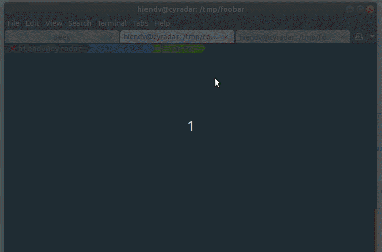

## What is this?
I'm trying to reproduce [this](https://github.com/ezolenko/rollup-plugin-typescript2/issues/32#issuecomment-438562119).



## How to reproduce
```bash
npm install

# it builds successfully
npm run build

# it also builds successfully, at first :(
npm run watch

# try to modify Parent.vue
# it should fail
```

```
rollup v0.67.3
bundles /tmp/foobar/src/main.ts → dist/ui.es.js...
[!] (rpt2 plugin) Error: Could not find file: '/tmp/foobar/src/components/Child.vue?rollup-plugin-vue=script.ts'.
Error: Could not find file: '/tmp/foobar/src/components/Child.vue?rollup-plugin-vue=script.ts'.
    at getValidSourceFile (/tmp/foobar/node_modules/typescript/lib/typescript.js:114851:23)
    at Object.getSyntacticDiagnostics (/tmp/foobar/node_modules/typescript/lib/typescript.js:115044:52)
    at cache.walkTree (/tmp/foobar/node_modules/rollup-plugin-typescript2/dist/rollup-plugin-typescript2.cjs.js:21609:87)
    at lodash_2 (/tmp/foobar/node_modules/rollup-plugin-typescript2/dist/rollup-plugin-typescript2.cjs.js:19778:71)
    at arrayEach (/tmp/foobar/node_modules/rollup-plugin-typescript2/dist/rollup-plugin-typescript2.cjs.js:532:11)
    at forEach (/tmp/foobar/node_modules/rollup-plugin-typescript2/dist/rollup-plugin-typescript2.cjs.js:9359:14)
    at TsCache.walkTree (/tmp/foobar/node_modules/rollup-plugin-typescript2/dist/rollup-plugin-typescript2.cjs.js:19778:13)
    at Object.ongenerate (/tmp/foobar/node_modules/rollup-plugin-typescript2/dist/rollup-plugin-typescript2.cjs.js:21606:25)
    at /tmp/foobar/node_modules/rollup/dist/rollup.js:20962:25

```
